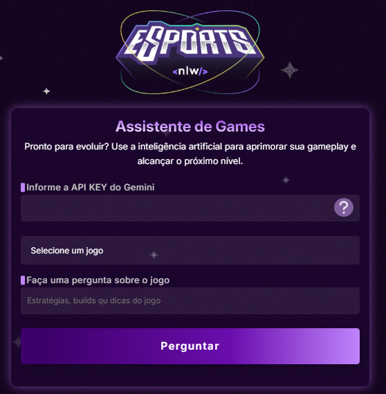

# 🕹️ Assistente de Games com IA — Projeto NLW Rocketseat

Este projeto foi desenvolvido como parte da trilha de front-end da **Next Level Week (NLW)** da [Rocketseat](https://rocketseat.com.br), com o objetivo de aplicar HTML, CSS e JavaScript em um projeto prático e atual: um assistente de games alimentado por inteligência artificial.

🔗 **Acesse o projeto online:**  
👉 [navarrocrn.github.io/NLW--Rocketseat](https://navarrocrn.github.io/NLW--Rocketseat)

---

## 🧠 Sobre o Projeto

O **Assistente de Games** é uma interface web que permite ao usuário inserir uma **API Key do Gemini (Google)** e receber respostas inteligentes com **dicas, estratégias e builds para jogos**, como Valorant, LoL, CS2, entre outros.

---

## 📸 Preview



## 🛠️ Tecnologias Utilizadas

- **HTML5** – estrutura da aplicação
- **CSS3** – estilização e responsividade
- **JavaScript (Vanilla)** – lógica e interação com API
- **Google Gemini API** – motor de inteligência artificial
- **Git & GitHub** – versionamento e deploy
- **GitHub Pages** – hospedagem do projeto

---

## 💡 Funcionalidades

- Inserção segura da API Key do Gemini
- Seleção de jogos populares
- Envio de perguntas e retorno com respostas da IA
- Design moderno, inspirado em eSports
- Layout responsivo para dispositivos móveis

---

## 🚀 Como Executar Localmente

1. Clone este repositório:

   ```bash
   git clone https://github.com/navarrocrn/NLW--Rocketseat.git

   ```

2. Acesse a pasta do projeto:
   cd NLW--Rocketseat

3. Abra o arquivo index.html em um navegador:
   Se estiver usando o VS Code, você pode usar a extensão Live Server
   Ou simplesmente clique duas vezes no index.html para abrir no navegador

4. Insira sua API Key do Gemini no campo indicado

5. Escolha um jogo, digite sua dúvida e clique em "Perguntar" 🎮

## 🔐 Requisitos

Você precisa de uma API Key válida do Gemini:

Crie sua chave em: https://aistudio.google.com/app/apikey

Copie e cole no campo indicado na interface

## 📌 Observações

- Este projeto é educacional e não armazena nenhuma chave de API.

- A comunicação com a IA é feita diretamente no navegador.

- Código limpo e comentado para aprendizado.

## 🧑‍💻 Autoria

Feito com 💜 por @navarrocrn
